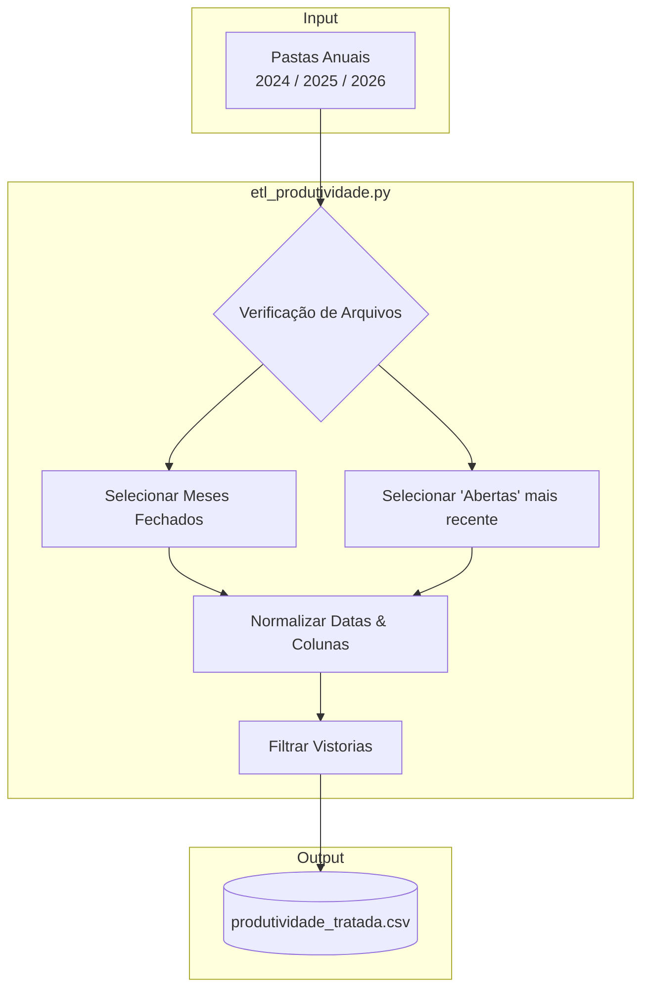
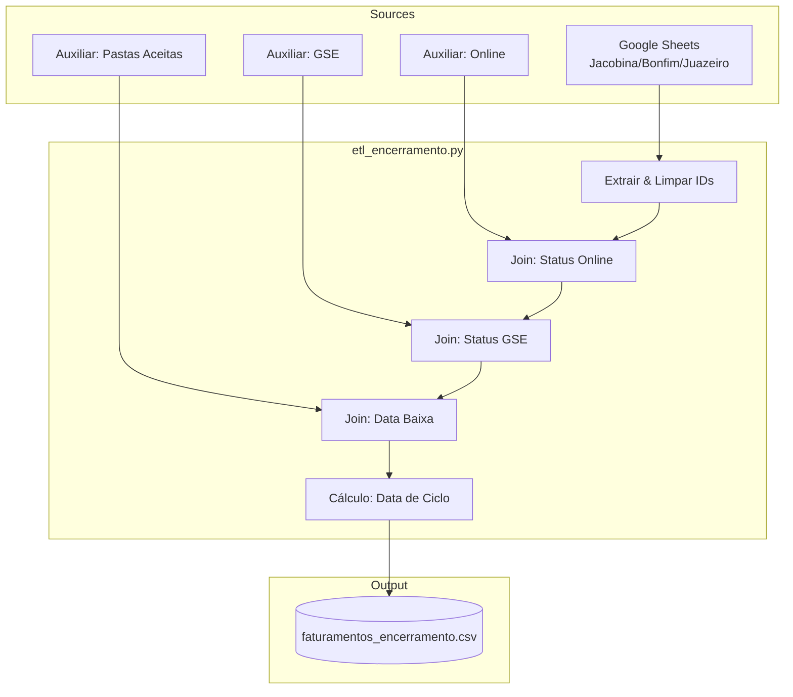
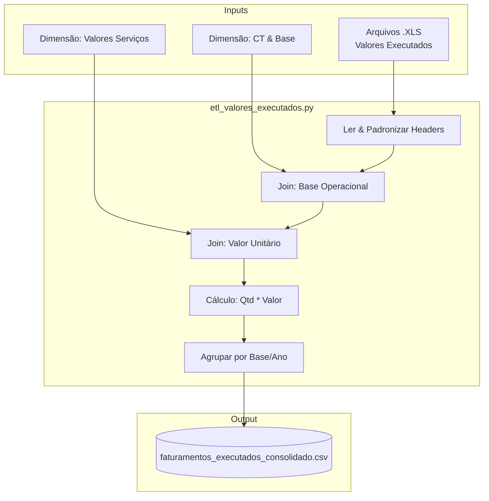
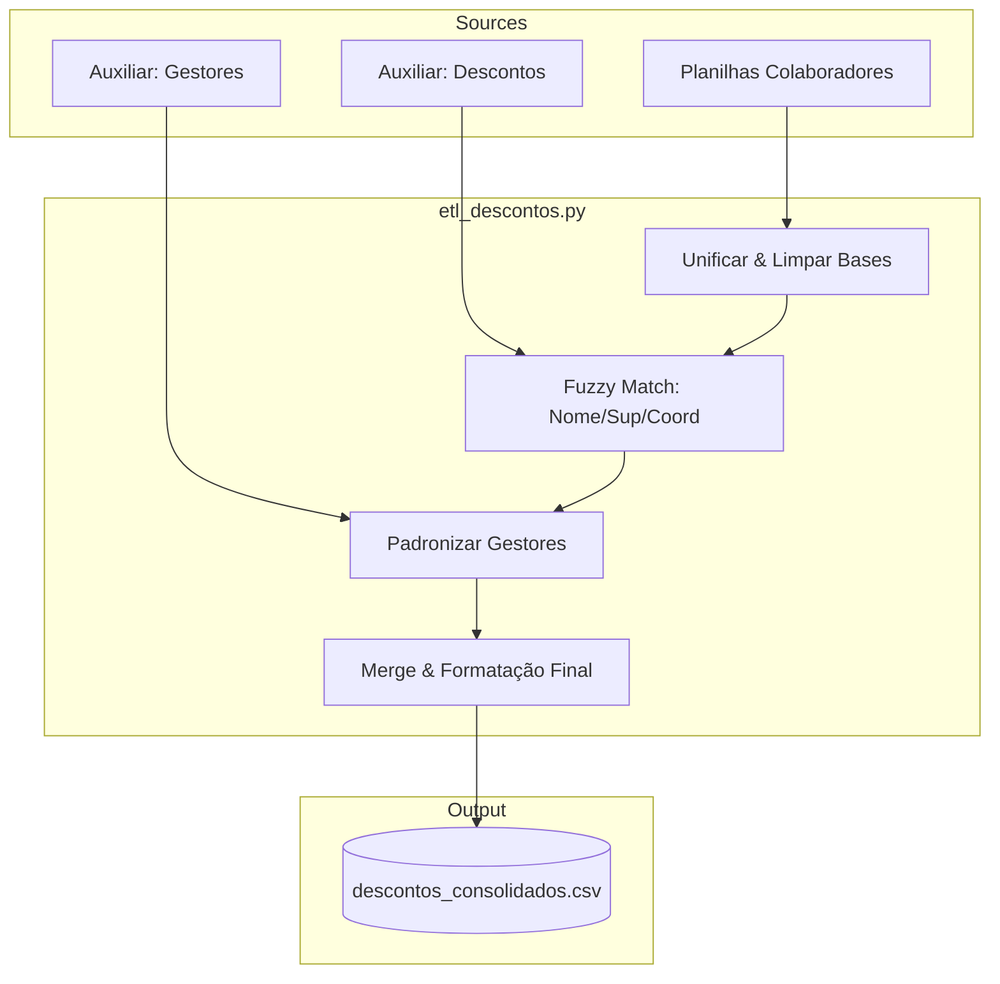
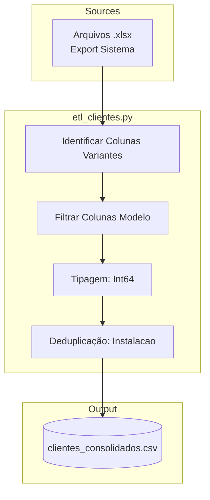
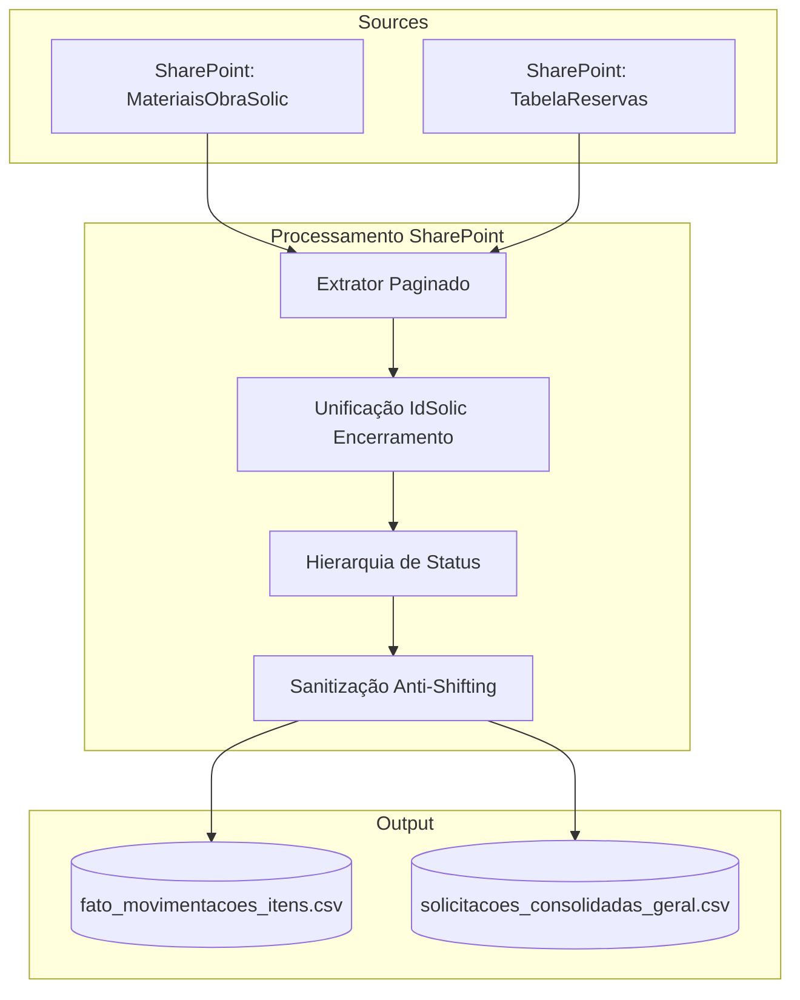
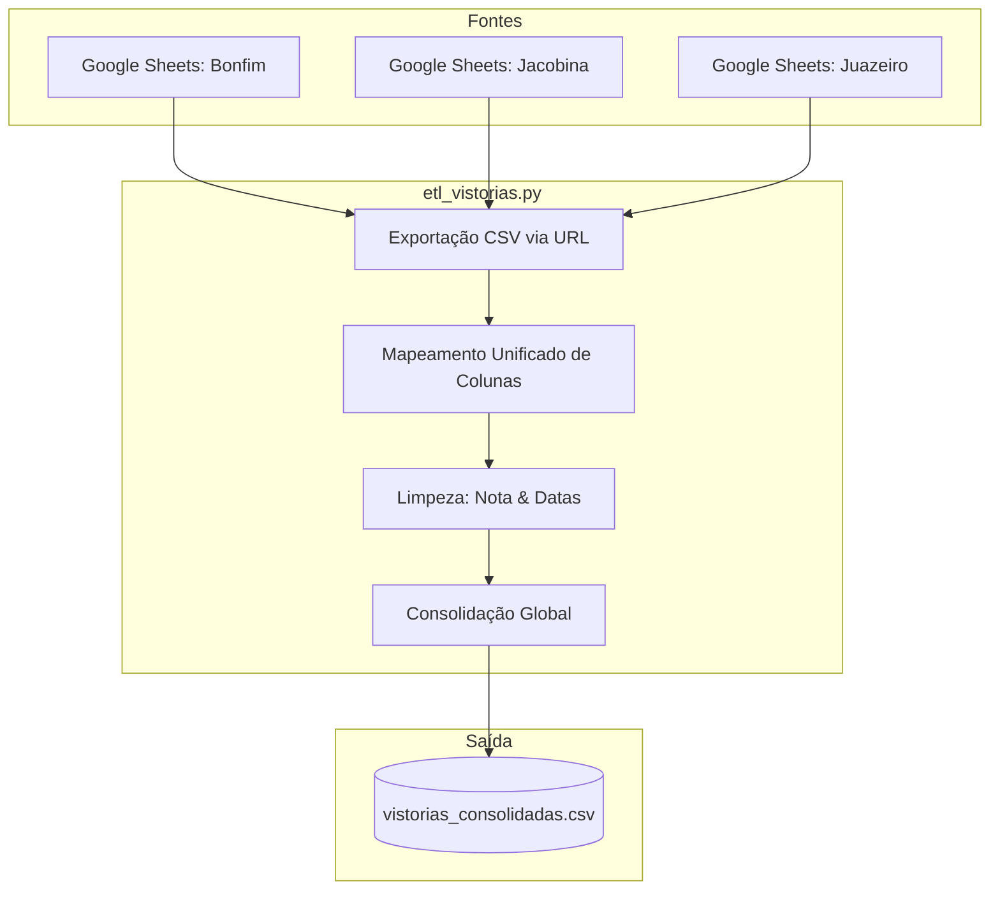

# Pipelines de Dados - SIPEL

Repositório centralizado para automação de extração, tratamento e carga de dados (ETL) da SIPEL. Este projeto utiliza Python de alto nível para garantir a integridade, padronização e escalabilidade dos dados corporativos.

## 🛠️ Tecnologias e Bibliotecas


### Detalhamento da Stack
*   **Python 3.10+**: Linguagem base para processamento de dados.
*   **Pandas**: Engine para manipulação de DataFrames e transformações complexas.
*   **Requests**: Extração de dados via HTTP/HTTPS (Google Sheets API/Export).
*   **Regex (Re)**: Higienização e padronização de strings.
*   **Logging**: Rastreabilidade e monitoramento de execução em tempo real.

---

## 🚀 Estrutura do Repositório

O repositório está organizado por pastas, onde cada uma representa um domínio de dados ou pipeline específico. A estrutura foi refatorada para padronizar o uso de um diretório `src` para todo o código-fonte.

```text
pipelines-dados-SIPEL/
├── clientes_leitura/
│   ├── data/
│   └── src/etl_clientes.py
├── descontos_seguranca/
│   ├── data/
│   └── src/etl_descontos.py
├── encerramento_tecnico/
│   ├── data/
│   └── src/etl_encerramento.py
├── faturamento_comercial/
│   ├── data/
│   ├── valores_executados/
│   └── src/
│       ├── etl_faturamento.py
│       └── etl_valores_executados.py
├── materiais_obra/
│   ├── data/
│   └── src/
├── vistorias_comercial/
│   ├── data/
│   ├── src/
│   └── etl_vistorias.py
├── .pre-commit-config.yaml      # Configuração dos Hooks de Pre-commit
├── GEMINI.md                      # Diretrizes da IA e padrões de engenharia
├── README.md                      # Documentação oficial
└── requirements.txt
```

## 🤖 Integração com Gemini AI

Este repositório segue diretrizes estritas de desenvolvimento definidas no arquivo `GEMINI.md`. A IA atua como um **Engenheiro de Dados Sênior**, garantindo:

1.  **Chain of Thought**: Análise lógica prévia (Fonte -> Sujeira -> Tratamento -> Validação).
2.  **Código Seguro**: Proteção contra *Type Errors*, tratamento de exceções específico e validação de schemas.
3.  **Manutenibilidade**: Código modular, tipado (`Type Hints`) e documentado.

---

## 🔬 Qualidade de Código e CI/CD

Este projeto está configurado com um pipeline de Integração Contínua (CI/CD) no GitHub Actions que valida a qualidade de todo o código enviado. Para facilitar o desenvolvimento e garantir que o código esteja em conformidade *antes* do commit, configuramos hooks de pre-commit.

### Ferramentas de Qualidade

*   **Ruff**: Um linter e formatador de Python extremamente rápido, usado para garantir a aderência aos padrões da PEP 8, ordenar imports e corrigir problemas de estilo automaticamente.
*   **MyPy**: Um checador de tipos estático que garante que todas as funções tenham anotações de tipo (`Type Hints`), prevenindo uma classe inteira de bugs em tempo de execução.
*   **Bandit**: Uma ferramenta que verifica o código em busca de vulnerabilidades de segurança comuns.
*   **pip-audit**: Audita as dependências do projeto em busca de pacotes com vulnerabilidades conhecidas.

### Configuração do Ambiente de Desenvolvimento (Pré-requisito)

Para que as verificações automáticas funcionem localmente, cada desenvolvedor deve configurar seu ambiente **uma única vez**:

1.  **Instale todas as dependências (de projeto e de desenvolvimento):**
    ```bash
    pip install -r requirements.txt
    pip install -r requirements-dev.txt
    ```

2.  **Ative os hooks de pre-commit no seu repositório local:**
    ```bash
    pre-commit install
    ```

Após estes passos, a cada tentativa de `git commit`, as ferramentas de qualidade serão executadas automaticamente. Se um erro for encontrado (e puder ser corrigido), o `pre-commit` fará a correção e o commit será interrompido. Basta adicionar os arquivos corrigidos (`git add .`) e tentar o commit novamente.

## ⚙️ Pipelines Ativos

### 1. Tratamento de Faturamentos Comerciais
*Local: `/faturamento_comercial`*
*Script: `src/etl_faturamento.py`*

Pipeline responsável por normalizar IDs de faturamento extraídos de múltiplas planilhas do Google Sheets.
*   **Input**: Links de exportação do Google Sheets.
*   **Regras de Negócio**:
    *   Remoção de cabeçalhos mesclados.
    *   Limpeza de prefixos alfanuméricos (`SOL`, `B-`, `X-`).
    *   **Normalização Estrita**: Preenchimento com zeros à esquerda (`zfill`) para garantir IDs com **7 dígitos**.
    *   Deduplicação global de registros.
*   **Output**: `data/processed/faturamentos_tratados.csv`.

### 2. Consolidação de Valores Executados
*Local: `/faturamento_comercial`*
*Script: `src/etl_valores_executados.py`*

Pipeline analítico para cálculo e consolidação financeira de serviços executados.
*   **Input**: Relatórios `.XLS` anuais (2024-2026) e Tabelas Dimensão (`dim_Ct`, `dim_valor_servicos`).
*   **Regras de Negócio**:
    *   **Enriquecimento**: Cruzamento com tabelas dimensionais para obter valores unitários e Base Operacional.
    *   **Cálculo**: Quantidade * Valor Unitário.
    *   **Consolidação**: Agrupamento por Base Operacional e soma anual.
    *   **Limpeza**: Tratamento de nulos e conversão de textos para floats.
*   **Output**: `data/processed/faturamentos_executados_consolidado.csv`.

### 3. Produtividade Comercial
*Local: `/produtividade_comercial`*
*Script: `src/etl_produtividade.py`*

Pipeline consolidado para processamento de relatórios de produtividade (Notas de Serviço) extraídos do sistema legado.
*   **Input**: Arquivos `.XLS` organizados por pastas de ano (`2024`, `2025`, `2026`).
*   **Lógica de Seleção**:
    *   Processa todos os arquivos mensais fechados.
    *   Identifica e processa **apenas o arquivo "Abertas" mais recente**.
*   **Regras de Negócio**:
    *   **Padronização de Datas**: Unificação para formato `datetime`.
    *   **Mapeamento de Colunas**: Renomeação de campos técnicos para termos de negócio.
    *   **Classificação**: Identificação de vistorias via regex no "Nº do pedido".
*   **Output**: `data/processed/produtividade_tratada.csv`.

### 4. Encerramento Técnico
*Local: `/encerramento_tecnico`*
*Script: `src/etl_encerramento.py`*

Pipeline de integração para rastreamento de encerramentos técnicos e status de projetos.
*   **Input**:
    *   Google Sheets (Jacobina, Bonfim, Juazeiro).
    *   Auxiliares Locais (`aux_online`, `aux_gse`, `aux_pastas_aceitas`).
*   **Regras de Negócio**:
    *   **Chave Primária**: Extração e normalização do `PROJETO` para 7 dígitos (`PROJETO_FATO`).
    *   **Cálculo de Ciclo**: Determinação automática da data de ciclo baseada no mês e data de baixa.
    *   **Enriquecimento**: Join com dados do sistema online e GSE para status atualizado.
    *   **Priorização**: Lógica para resolver duplicatas baseada na data de análise mais recente.
*   **Output**: `data/processed/faturamentos_encerramento.csv`.

### 5. Descontos de Segurança
*Local: `/descontos_segurança`*
*Script: `src/etl_descontos.py`*

Pipeline projetado para consolidar dados de colaboradores de múltiplas bases (Bonfim, Jacobina, Juazeiro) e cruzá-los com um arquivo de descontos de segurança.
*   **Input**:
    *   Planilhas de colaboradores por base (`aux_colaboradores_*.xlsx`).
    *   Arquivo de descontos (`aux_descontos.csv`).
    *   Tabela de Gestores (`aux_gestores.xlsx`).
*   **Regras de Negócio**:
    *   **Higienização Estrita**: Filtragem de linhas de "lixo" (cabeçalhos repetidos, totais, linhas vazias) nas planilhas de colaboradores.
    *   **Padronização de Gestores**: Normalização dos nomes dos gestores utilizando a tabela auxiliar `aux_gestores`, com lógica de *Fuzzy Matching* para garantir consistência com o dashboard.
    *   **Correspondência em Cascata (Fuzzy Matching)**:
        1.  Tenta uma correspondência aproximada de alta precisão (limiar de 96%) entre o nome do funcionário no arquivo de descontos e a base de colaboradores.
        2.  Para falhas, tenta uma segunda correspondência, buscando o nome do funcionário apenas dentro da equipe do `Supervisor` listado.
        3.  Como último recurso, repete a busca dentro da equipe do `Coordenador`.
    *   **Tratamento de Nulos**: Preenchimento inteligente de campos vazios como "Não Especificado" para evitar strings "Nan".
*   **Output**: `data/processed/descontos_consolidados.csv`.

### 6. Clientes e Leitura
*Local: `/clientes_leitura`*
*Script: `src/etl_clientes.py`*

Pipeline de padronização de cadastros de clientes para rotas de leitura.
*   **Input**: Arquivos `.xlsx` brutos exportados do sistema comercial.
*   **Regras de Negócio**:
    *   **Mapeamento Flexível**: Identifica colunas baseando-se em variantes de nomes (ex: "Instal", "Instalação") para suportar diferentes layouts de exportação.
    *   **Tipagem Estrita**: Conversão de `instalacao` e `conta_contrato` para Inteiros (Int64), removendo o sufixo `.0` comum em leituras do Excel.
    *   **Deduplicação**: Garante registros únicos por número de instalação.
*   **Output**: `data/processed/clientes_consolidados.csv`.

### 7. Materiais de Obra (SharePoint)
*Local: `/materiais_obra`*
*Scripts: `src/etl_materiais.py`, `src/etl_reservas.py`, `src/etl_movimentacoes_detalhada.py`*

Ecossistema de pipelines para gestão de suprimentos e movimentação de materiais, integrado diretamente ao SharePoint corporativo.
*   **Input**:
    *   Listas do SharePoint (`MateriaisObraSolic` e `TabelaReservas`).
*   **Regras de Negócio**:
    *   **Unificação de IdSolic**: Para processos de Encerramento, o pipeline gera um ID de negócio único baseado na combinação de obra, data e reserva, permitindo o rastreamento fim-a-fim.
    *   **Hierarquia de Status**: Resolução lógica de status para solicitações agrupadas (ex: se um item for "Pendente" e outro "Confirmado", a solicitação assume status "Mov. Parcial").
    *   **Higienização de Dados**: Remoção de caracteres especiais que rompem a estrutura de arquivos CSV e normalização de nomes de materiais e colaboradores.
    *   **Consolidação Geral**: Cruzamento automático entre solicitações diretas e reservas técnicas para uma visão 360º do almoxarifado.
*   **Output**: `data/processed/solicitacoes_consolidadas_geral.csv` e `fato_movimentacoes_itens.csv`.

### 8. Vistorias Comercial
*Local: `/vistorias_comercial`*
*Script: `src/etl_vistorias.py`*

Pipeline de consolidação de vistorias técnicas registradas em planilhas do Google Sheets para as bases de Senhor do Bonfim, Jacobina e Juazeiro.
*   **Entrada**: Exportação via CSV das planilhas de controle de vistorias (Google Sheets).
*   **Regras de Negócio**:
    *   **Mapeamento Unificado**: Padronização de nomes de colunas variantes entre as bases (ex: "UTEP" -> "MUNICIPIO", "LOCAL" -> "MUNICIPIO", "COLABORADOR" -> "RESPONSAVEL").
    *   **Higienização de Notas**: Garantia de que o campo `NOTA` seja estritamente numérico (Inteiro).
    *   **Tratamento de Datas**: Conversão robusta de datas com suporte ao formato brasileiro e remoção de registros sem data de contato.
    *   **Consolidação**: Unificação de todas as bases em um único schema de saída com 7 colunas essenciais.
*   **Saída**: `data/processed/vistorias_consolidadas.csv`.

## 📦 Como Executar os Pipelines

Após configurar o ambiente de desenvolvimento (ver seção "Qualidade de Código e CI/CD"), você pode executar os pipelines individualmente a partir da raiz do projeto.

**Faturamento (IDs):**
```bash
python faturamento_comercial/src/etl_faturamento.py
```

**Valores Executados:**
```bash
python faturamento_comercial/src/etl_valores_executados.py
```

**Produtividade:**
```bash
python produtividade_comercial/src/etl_produtividade.py
```

**Encerramento Técnico:**
```bash
python encerramento_tecnico/src/etl_encerramento.py
```

**Descontos de Segurança:**
```bash
python descontos_seguranca/src/etl_descontos.py
```

**Clientes e Leitura:**
```bash
python clientes_leitura/src/etl_clientes.py
```

**Materiais de Obra (Completo):**
```bash
# 1. Extrair solicitações e reservas (Requer .env configurado)
python materiais_obra/src/etl_materiais.py
python materiais_obra/src/etl_reservas.py

# 2. Consolidar movimentações detalhadas
python materiais_obra/src/etl_movimentacoes_detalhada.py
```

**Vistorias Comercial:**
```bash
python vistorias_comercial/src/etl_vistorias.py
```

---

## 📊 Diagramas de Fluxo

### 1. Produtividade Comercial


### 2. Encerramento Técnico


### 3. Valores Executados (Financeiro)


### 4. Descontos de Segurança


### 5. Clientes e Leitura


### 6. Materiais de Obra (SharePoint)


### 7. Vistorias Comercial


## 📄 Licença
Este projeto é privado e de uso exclusivo da SIPEL.
