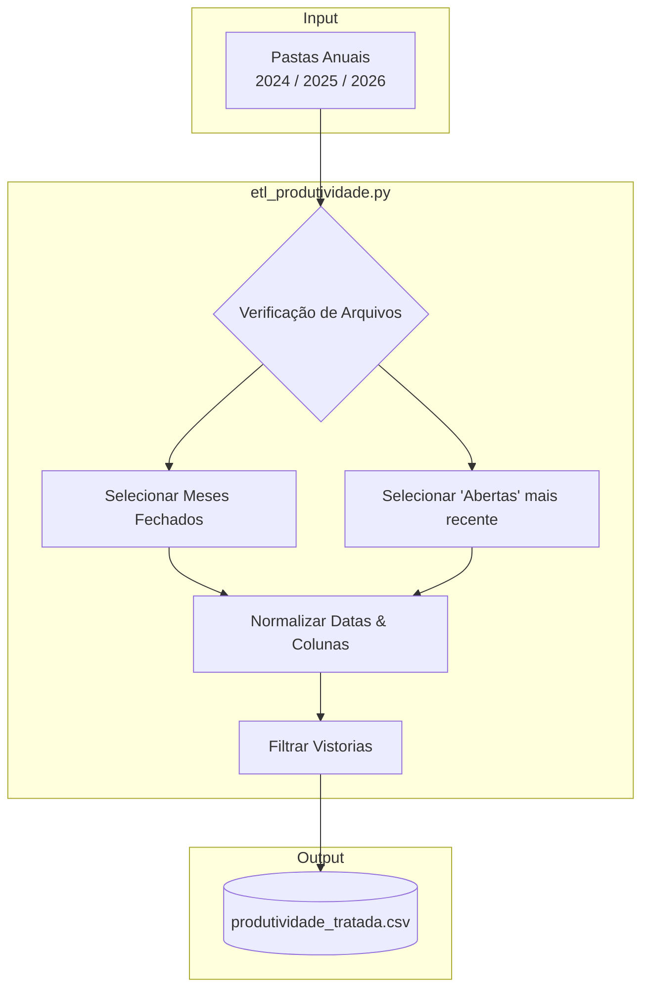
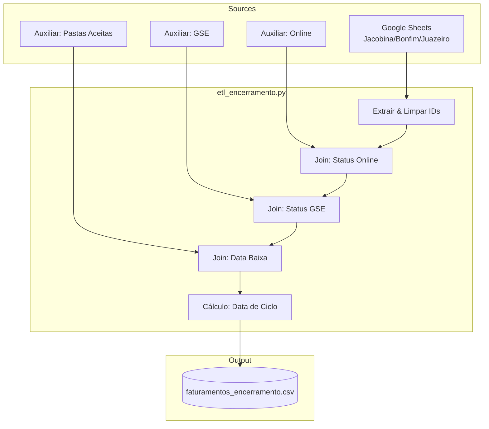
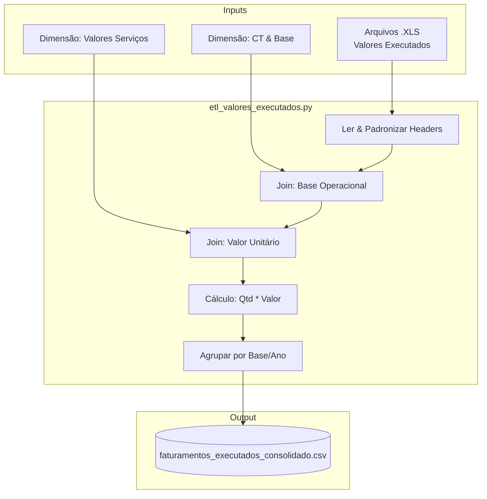
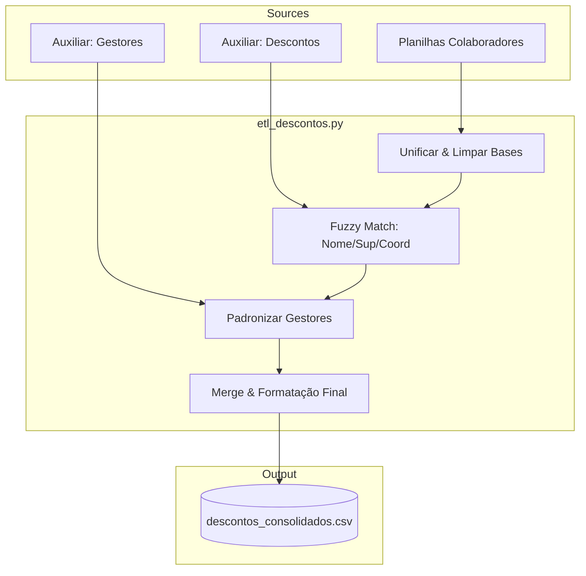

# Pipelines de Dados - SIPEL

Repositório centralizado para automação de extração, tratamento e carga de dados (ETL) da SIPEL. Este projeto utiliza Python de alto nível para garantir a integridade, padronização e escalabilidade dos dados corporativos.

## 🛠️ Tecnologias e Bibliotecas


### Detalhamento da Stack
*   **Python 3.10+**: Linguagem base para processamento de dados.
*   **Pandas**: Engine para manipulação de DataFrames e transformações complexas.
*   **Requests**: Extração de dados via HTTP/HTTPS (Google Sheets API/Export).
*   **Regex (Re)**: Higienização e padronização de strings.
*   **Logging**: Rastreabilidade e monitoramento de execução em tempo real.

---

## 🚀 Estrutura do Repositório

O repositório está organizado por pastas, onde cada uma representa um domínio de dados ou pipeline específico:

```text
pipelines-dados-SIPEL/
├── encerramento_tecnico/          # Pipeline de Encerramento Técnico (Novo)
│   ├── data/                      # Dados auxiliares e processados
│   └── src/etl_encerramento.py    # Script principal de ETL
├── faturamento_comercial/         # Pipeline de Faturamento
│   ├── etl_faturamento.py         # Tratamento de IDs Google Sheets
│   ├── etl_valores_executados.py  # Consolidação de Valores Executados (Novo)
│   ├── valores_executados/        # Arquivos .XLS e Dimensões
│   └── faturamentos_tratados.csv  # Output gerado
├── produtividade_comercial/       # Pipeline de Produtividade
│   ├── 2024/                      # Arquivos fonte (Histórico)
│   ├── 2025/                      # Arquivos fonte (Corrente)
│   ├── etl_produtividade.py       # Script principal de ETL
│   └── produtividade_tratada.csv  # Output gerado (CSV ; UTF-8)
├── GEMINI.md                      # Diretrizes da IA e padrões de engenharia
├── README.md                      # Documentação oficial
└── .gitignore                     # Configuração de exclusão do Git
```

## 🤖 Integração com Gemini AI

Este repositório segue diretrizes estritas de desenvolvimento definidas no arquivo `GEMINI.md`. A IA atua como um **Engenheiro de Dados Sênior**, garantindo:

1.  **Chain of Thought**: Análise lógica prévia (Fonte -> Sujeira -> Tratamento -> Validação).
2.  **Código Seguro**: Proteção contra *Type Errors*, tratamento de exceções específico e validação de schemas.
3.  **Manutenibilidade**: Código modular, tipado (`Type Hints`) e documentado.

## ⚙️ Pipelines Ativos

### 1. Tratamento de Faturamentos Comerciais
*Local: `/faturamento_comercial`*
*Script: `etl_faturamento.py`*

Pipeline responsável por normalizar IDs de faturamento extraídos de múltiplas planilhas do Google Sheets.
*   **Input**: Links de exportação do Google Sheets.
*   **Regras de Negócio**:
    *   Remoção de cabeçalhos mesclados.
    *   Limpeza de prefixos alfanuméricos (`SOL`, `B-`, `X-`).
    *   **Normalização Estrita**: Preenchimento com zeros à esquerda (`zfill`) para garantir IDs com **7 dígitos**.
    *   Deduplicação global de registros.

### 2. Consolidação de Valores Executados
*Local: `/faturamento_comercial`*
*Script: `etl_valores_executados.py`*

Pipeline analítico para cálculo e consolidação financeira de serviços executados.
*   **Input**: Relatórios `.XLS` anuais (2024-2026) e Tabelas Dimensão (`dim_Ct`, `dim_valor_servicos`).
*   **Regras de Negócio**:
    *   **Enriquecimento**: Cruzamento com tabelas dimensionais para obter valores unitários e Base Operacional.
    *   **Cálculo**: Quantidade * Valor Unitário.
    *   **Consolidação**: Agrupamento por Base Operacional e soma anual.
    *   **Limpeza**: Tratamento de nulos e conversão de textos para floats.
*   **Output**: `faturamentos_executados_consolidado.csv`.

### 3. Produtividade Comercial
*Local: `/produtividade_comercial`*
*Script: `etl_produtividade.py`*

Pipeline consolidado para processamento de relatórios de produtividade (Notas de Serviço) extraídos do sistema legado.
*   **Input**: Arquivos `.XLS` organizados por pastas de ano (`2024`, `2025`, `2026`).
*   **Lógica de Seleção**:
    *   Processa todos os arquivos mensais fechados.
    *   Identifica e processa **apenas o arquivo "Abertas" mais recente**.
*   **Regras de Negócio**:
    *   **Padronização de Datas**: Unificação para formato `datetime`.
    *   **Mapeamento de Colunas**: Renomeação de campos técnicos para termos de negócio.
    *   **Classificação**: Identificação de vistorias via regex no "Nº do pedido".
    *   **Output**: CSV UTF-8 SIG com separador ponto e vírgula.

### 4. Encerramento Técnico
*Local: `/encerramento_tecnico`*
*Script: `src/etl_encerramento.py`*

Pipeline de integração para rastreamento de encerramentos técnicos e status de projetos.
*   **Input**:
    *   Google Sheets (Jacobina, Bonfim, Juazeiro).
    *   Auxiliares Locais (`aux_online`, `aux_gse`, `aux_pastas_aceitas`).
*   **Regras de Negócio**:
    *   **Chave Primária**: Extração e normalização do `PROJETO` para 7 dígitos (`PROJETO_FATO`).
    *   **Cálculo de Ciclo**: Determinação automática da data de ciclo baseada no mês e data de baixa.
    *   **Enriquecimento**: Join com dados do sistema online e GSE para status atualizado.
    *   **Priorização**: Lógica para resolver duplicatas baseada na data de análise mais recente.
*   **Output**: `data/processed/faturamentos_encerramento.csv`.

### 5. Descontos de Segurança
*Local: `/descontos_segurança`*
*Script: `src/etl_descontos.py`*

Pipeline projetado para consolidar dados de colaboradores de múltiplas bases (Bonfim, Jacobina, Juazeiro) e cruzá-los com um arquivo de descontos de segurança.
*   **Input**:
    *   Planilhas de colaboradores por base (`aux_colaboradores_*.xlsx`).
    *   Arquivo de descontos (`aux_descontos.csv`).
    *   Tabela de Gestores (`aux_gestores.xlsx`).
*   **Regras de Negócio**:
    *   **Higienização Estrita**: Filtragem de linhas de "lixo" (cabeçalhos repetidos, totais, linhas vazias) nas planilhas de colaboradores.
    *   **Padronização de Gestores**: Normalização dos nomes dos gestores utilizando a tabela auxiliar `aux_gestores`, com lógica de *Fuzzy Matching* para garantir consistência com o dashboard.
    *   **Correspondência em Cascata (Fuzzy Matching)**:
        1.  Tenta uma correspondência aproximada de alta precisão (limiar de 96%) entre o nome do funcionário no arquivo de descontos e a base de colaboradores.
        2.  Para falhas, tenta uma segunda correspondência, buscando o nome do funcionário apenas dentro da equipe do `Supervisor` listado.
        3.  Como último recurso, repete a busca dentro da equipe do `Coordenador`.
    *   **Tratamento de Nulos**: Preenchimento inteligente de campos vazios como "Não Especificado" para evitar strings "Nan".
*   **Output**: `data/processed/descontos_consolidados.csv`.

## 📦 Como Executar

### Instalação das Dependências
Para garantir que todas as bibliotecas necessárias estejam instaladas, execute o seguinte comando na raiz do projeto:
```bash
pip install -r requirements.txt
```

### Execução dos Pipelines

**Faturamento (IDs):**
```bash
cd faturamento_comercial
python etl_faturamento.py
```

**Valores Executados:**
```bash
cd faturamento_comercial
python etl_valores_executados.py
```

**Produtividade:**
```bash
cd produtividade_comercial
python etl_produtividade.py
```

**Encerramento Técnico:**
```bash
cd encerramento_tecnico/src
python etl_encerramento.py
```

**Descontos de Segurança:**
```bash
python descontos_segurança/src/etl_descontos.py
```

---

## 📊 Diagramas de Fluxo

### 1. Produtividade Comercial


### 2. Encerramento Técnico


### 3. Valores Executados (Financeiro)


### 4. Descontos de Segurança


## 📄 Licença
Este projeto é privado e de uso exclusivo da SIPEL.
